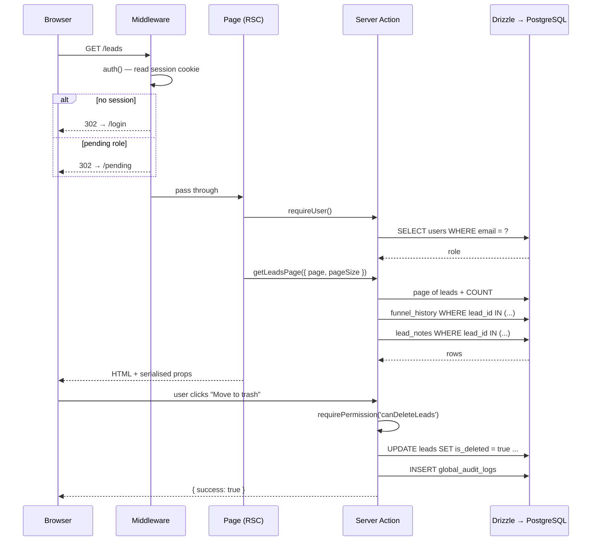

# Architecture

## Stack

| Layer | Choice | Notes |
|---|---|---|
| Framework | Next.js 16.3.1, App Router | React 19.2.8 |
| Language | TypeScript 5 | `strict: true`, and `ignoreBuildErrors` is now **off** |
| Database | PostgreSQL 17 | Self-hosted on Coolify, not exposed to the internet |
| ORM | Drizzle ORM | Type-safe SQL, no runtime query builder |
| Auth | Auth.js (NextAuth v5) + Google OAuth | Database-backed sessions |
| Styling | Tailwind CSS v4 | |
| Deployment | Docker → Coolify | Multi-stage, `output: 'standalone'` |
| Analytics | Postgres `next-auth`, `papaparse`, `sonner`, `zustand`, `motion` | |

## What changed, and why

The previous version was **Next.js on Vercel with Supabase** for both database
and authentication. The move to a single VPS removed two platform services at
once, and the replacements are not drop-in.

### Supabase PostgREST → Drizzle

Every client component talked to the database **directly from the browser**,
using the Supabase anon key and PostgREST's query syntax. That meant the
database schema was effectively part of the client bundle, and the UI was
coupled to a REST dialect:

- Embedded resources — `select('*, funnelHistory:funnel_history(*)')`
- FK-name hints — `users!tasks_assigned_to_fkey(name)`, which depended on
  Postgres' auto-generated constraint name
- RPCs — `supabase.rpc('get_dashboard_stats', {...})`
- Count headers — `select('*', { count: 'exact', head: true })`

All data access now goes through **server actions**. Client components receive
data as props and call actions on demand. The consequences:

- The database is only reachable from the server. The anon key is gone entirely.
- PostgREST constructs become explicit `leftJoin`s, two-query `inArray` fetches,
  or `sql` templates.
- Every write is in one place with one validation path, instead of being
  scattered across a dozen components.

### Supabase RLS → server-side permission guards

This is the most important change, and it is not cosmetic.

Under Supabase, **RLS was the only real authorization boundary**. Policies in
`fix_rls.sql` decided whether a signed-in staff member could read or write a
row. The `user.role === 'lord'` checks in the components were JSX render
conditions — they hid buttons, they did not stop requests.

Those policies were also unreliable in practice: migration
`00000000000002_recreate_schema_text.sql` ran `ALTER TABLE … DISABLE ROW LEVEL
SECURITY` on eleven tables and never re-enabled them, and `fix_rls.sql` created
policies without ever running `ENABLE ROW LEVEL SECURITY`. Policy statements
without RLS active have no effect.

With a direct Postgres connection there is no policy engine at all. Authorization
is now explicit and server-side:

- [`src/lib/permissions.ts`](../src/lib/permissions.ts) — the role matrix
- [`src/lib/auth.ts`](../src/lib/auth.ts) — `requireUser`, `requirePermission`,
  `requireLord`, `requireLordOrAdmin`
- Every server action calls a guard before touching data

```ts
export async function permanentlyDeleteLeads(ids: string[]) {
  const user = await requireLord();   // throws unless role === 'lord'
  // ... never reads role from the client
}
```

Role is always read from the database, never from a request body.

### Supabase Auth → Auth.js

The user-facing flow is unchanged: press **Lanjutkan dengan Google**, land back
on the CRM. The plumbing underneath is new:

| Before | After |
|---|---|
| `supabase.auth.signInWithOAuth({ provider: 'google' })` | `signIn('google')` server action |
| `/auth/callback` exchanging a `?code=` for a cookie | Auth.js `/api/auth/callback/google` |
| `supabase.auth.getUser()` on every request | `auth()` reads the session locally |
| `supabase.auth.signOut()` from the client | `signOut()` server action |
| `auth.users` table | `accounts` + `sessions` in our own Postgres |

Auto-registration of unknown Google accounts as `pending` now happens in the
`signIn` callback, in one place. The old app did it in the root layout with an
`INSERT` on every render, while the pages used an `UPSERT` for the same job —
so two concurrent first logins could collide on the unique email constraint and
throw inside the root layout.

Sessions are stored in the database rather than signed into a JWT, so an admin
promoting a user takes effect on that user's next request instead of persisting
until the token expired.

## Request flow



Note the direction change: the browser no longer holds a database credential, so
every read and write crosses a server boundary that can authorise it.

## Data access patterns

**Pagination.** The leads list previously loaded all ~6,000 rows into the
browser with a `while (hasMore)` loop, transferring 3–5 MB of JSON per visit —
and the range query had no `ORDER BY`, so rows could be skipped or duplicated
whenever the table changed mid-scan. Now a page of leads is resolved first, then
history and notes are fetched in two batched queries keyed by that page's ids.
Row count is stable and the join fan-out is bounded by page size.

**Aggregation.** `getDashboardStats`, `getIndividualContributions` and
`getGhostedLeads` are single SQL statements. The dashboard previously ran the
same aggregate in Postgres *and* recomputed it in a `useMemo` inside the client
component; the two implementations drifted. There is now one.

**Transactions.** Multi-table writes are wrapped in `db.transaction()`. The
status update path — lead row, funnel entry, audit note — used to be three
separate browser requests, so a failure between them left a lead claiming a
stage it had no history for.

**Batch, not N+1.** The per-row `SELECT`/`DELETE` loops for `oi_forecasts` are
gone; `leads.id` has `ON DELETE CASCADE`, so deleting a lead removes its
forecasts in one statement.

## Directory layout

```
src/
├── auth.ts                     Auth.js config (providers, callbacks, session)
├── middleware.ts               Route protection + role gates
├── types.ts                    DTOs shared between server and client
├── db/
│   ├── schema.ts               Domain tables (Drizzle)
│   ├── auth-schema.ts          Auth.js tables
│   ├── enums.ts                Postgres enums
│   └── index.ts                Connection pool + `db` instance
├── lib/
│   ├── auth.ts                 requireUser / requirePermission / requireLord
│   ├── auth-users.ts           User lookup and registration
│   ├── permissions.ts          Role → permission matrix
│   └── utils.ts                `cn()` Tailwind helper
├── app/
│   ├── (app)/                  Authenticated shell
│   │   ├── layout.tsx          Reads the user, renders PendingScreen or AppLayout
│   │   ├── page.tsx            Dashboard / leads pipeline
│   │   ├── leads/              Leads database
│   │   ├── lead/[id]/          Lead detail
│   │   ├── oi_forecast/        Operational income
│   │   ├── tasks/              Task management
│   │   ├── admin/{users,targets,approvals}/
│   │   └── permissions/
│   ├── actions/                Server actions — the only data-access layer
│   ├── api/auth/[...nextauth]/ Auth.js route handler
│   ├── login/                  Google sign-in
│   ├── pending/                Awaiting-approval screen
│   └── layout.tsx              Minimal: html/body only
├── components/                 Client components
└── hooks/useCategories.ts
```

The `(app)` route group is why `/login` and `/pending` render without the
sidebar shell, without each page needing its own guard.

## Environment variables

See [`.env.example`](../.env.example).

| Variable | Purpose |
|---|---|
| `DATABASE_URL` | **Internal** Coolify URL for `crm-sales-db`. Never the external one — the database is not internet-exposed. |
| `AUTH_SECRET` | Signs and encrypts session cookies. Required in production. |
| `AUTH_TRUST_HOST` | `true` behind Coolify's proxy. |
| `AUTH_URL` | Public origin, used to build the OAuth redirect URI. |
| `AUTH_GOOGLE_ID` / `AUTH_GOOGLE_SECRET` | Google OAuth client. |

None of these belong in the repository. Set them as environment variables on
the Coolify application resource.
