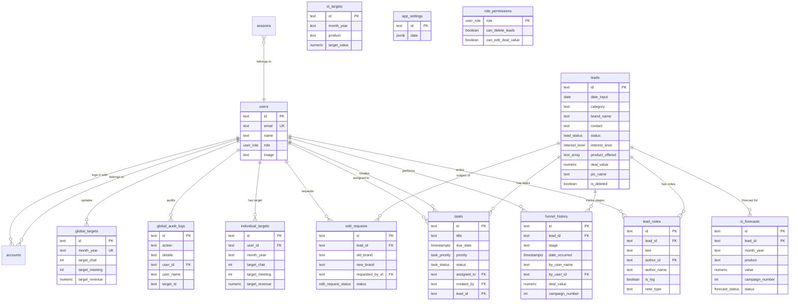

# Database Schema

PostgreSQL 17, managed by Drizzle ORM. This document is the reference for table
structure, relationships, and the reasoning behind decisions that differ from
the previous Supabase schema.

## Entity relationship diagram



## Table reference

### `users`

Application users. One row per person who has ever signed in.

| Column | Type | Notes |
|---|---|---|
| `id` | `text` PK | Internal identifier. **Inherited from the legacy Firestore UID.** See "Primary keys" below. |
| `auth_id` | `text` | Supabase Auth UUID. No longer written; retained so the value can be reconciled during migration. |
| `email` | `text` **unique** | Google account email. The natural key. |
| `name` | `text` | Display name. |
| `email_verified` | `timestamptz` | Required by the Auth.js adapter. |
| `image` | `text` | Avatar URL. |
| `role` | `user_role` | `lord` \| `admin` \| `staff` \| `pending`. Default `pending`. |
| `created_at` / `updated_at` | `timestamptz` | |

**`role` lifecycle.** A new Google sign-in is auto-registered as `pending`.
`pending` users are authenticated but can see no CRM data — the middleware
redirects them to `/pending`. An admin promotes them from `/admin/users`.

### `leads`

The core entity. One row per brand/contact pair in the pipeline.

| Column | Type | Notes |
|---|---|---|
| `id` | `text` PK | Legacy Firestore document ID. |
| `date_input` | `date` | When the lead entered the system. |
| `category` | `text` not null | Industry segment. |
| `brand_name` | `text` not null | |
| `contact` | `text` not null | WhatsApp number. |
| `lead_source` | `text` default `'-'` | Shopee, Tokopedia, TikTok Shop, etc. |
| `email` | `text` | |
| `status` | `lead_status` | Current pipeline stage. |
| `interest_level` | `interest_level` | `HOT` \| `WARM` \| `COLD` \| `-`. |
| `product_offered` | `text[]` | Subset of `MCN`, `TNT`, `HYPE`. |
| `action_plan` | `text` | Free text. |
| `date_chated` … `date_failed` | `timestamptz` | **Denormalised** stage timestamps, derived from `funnel_history`. |
| `deal_value` | `numeric(18,2)` | Closing amount. |
| `pic_name` | `text` | Person in charge. |
| `is_deleted` | `boolean` | Soft delete flag. |
| `deleted_at` / `auto_delete_at` | `timestamptz` | Trash timestamp; auto-delete set 30 days out. |
| `created_at` / `updated_at` | `timestamptz` | |

The `date_*` columns duplicate information already in `funnel_history`. They are
kept because the dashboard and pipeline table read them directly, and rewriting
those queries as lateral joins per row was measurably slower. They are kept in
sync inside the same transaction as every funnel write — see
[`addFunnelHistory`](../src/app/actions/lead-actions.ts).

### `funnel_history`

Append-only stage log. The authoritative record of how a lead moved.

| Column | Type | Notes |
|---|---|---|
| `id` | `text` PK | `gen_random_uuid()::text` by default. |
| `lead_id` | `text` FK → `leads.id` | `ON DELETE CASCADE`. |
| `stage` | `text` | Plain text, not an enum — a stage can be recorded as free text when retro-filling. |
| `date_occurred` | `timestamptz` not null | When the stage was actually reached. |
| `by_user_name` | `text` not null | Denormalised display name — attribution survives user deletion. |
| `by_user_id` | `text` FK → `users.id` | `ON DELETE SET NULL`. |
| `note` | `text` | |
| `assigned_by` | `text` | Who assigned the PIC. |
| `deal_value` | `numeric(18,2)` | Closing value at this stage. |
| `campaign_number` | `integer` | 1, 2, … for repeat orders. |

**`campaign_number` supports repeat orders.** A brand that closes twice in a year
gets two `Close Win` rows, distinguished by campaign number. This is what makes
the "sudah punya Campaign Ke-1" warning in the status modal possible.

### `lead_notes`

Free-text notes and system log entries attached to a lead.

| Column | Type | Notes |
|---|---|---|
| `id` | `text` PK | |
| `lead_id` | `text` FK → `leads.id` | `ON DELETE CASCADE`. |
| `text` | `text` not null | Markdown, rendered with `react-markdown`. |
| `author_id` | `text` FK → `users.id` | `ON DELETE SET NULL`. |
| `author_name` | `text` not null | Denormalised, so notes stay attributable. |
| `is_log` | `boolean` | `true` for auto-generated entries. |
| `note_type` | `text` | `note` \| `action_plan`. |

### `tasks`

To-dos, optionally attached to a lead.

| Column | Type | Notes |
|---|---|---|
| `id` | `text` PK | |
| `title` / `description` | `text` | |
| `due_date` | `timestamptz` not null | |
| `priority` | `task_priority` | `Low` \| `Medium` \| `High`. |
| `status` | `task_status` | `Todo` \| `In Progress` \| `Done`. |
| `assigned_to` | `text` FK → `users.id` | `ON DELETE SET NULL`. |
| `assigned_to_name` | `text` | Denormalised for display. |
| `created_by` / `created_by_name` | `text` | |
| `lead_id` | `text` FK → `leads.id` | `ON DELETE SET NULL`. |

### `edit_requests`

Staff cannot edit master data (brand name, contact) directly. They file a
request; an admin approves it in `/admin/approvals`.

| Column | Type | Notes |
|---|---|---|
| `id` | `text` PK | |
| `lead_id` | `text` FK → `leads.id` | `ON DELETE CASCADE`. |
| `old_brand` / `new_brand` | `text` | |
| `old_contact` / `new_contact` | `text` | |
| `requested_by_id` | `text` FK → `users.id` | |
| `requested_by_name` | `text` | |
| `status` | `edit_request_status` | `pending` \| `approved` \| `rejected`. |
| `created_at` | `timestamptz` | |
| `resolved_at` / `resolved_by` | `timestamptz` / `text` | |

### `oi_forecasts`

Operational Income tracking. **One row per lead, month, product, and campaign
number** — this is how repeat orders are represented financially.

| Column | Type | Notes |
|---|---|---|
| `id` | `text` PK | |
| `lead_id` | `text` FK → `leads.id` | `ON DELETE CASCADE`. |
| `month_year` | `text` | `YYYY-MM`. |
| `product` | `text` | `MCN` \| `TNT` \| `HYPE`. |
| `value` | `numeric(18,2)` | Forecast amount. |
| `campaign_number` | `integer` | Repeat-order index. |
| `budget_ads` / `budget_creator` | `numeric(18,2)` | |
| `gross_margin` | `numeric(18,2)` | Derived: `value - budget_ads - budget_creator`, floored at 0. |
| `real_margin` / `real_payment` | `numeric(18,2)` | Actuals, filled in after the fact. |
| `target_gmv` / `target_creator` | `numeric(18,2)` | |
| `target_video_affiliate` / `target_video_internal` / `target_views` | `integer` | |
| `success_rate` | `numeric(8,2)` | |
| `status` | `forecast_status` | `WIN` \| `OPEN` \| `LOSE`. |
| `tier` | `text` | `A`/`B`/`C`/`D`/`-`. |
| `category`, `last_follow_up`, `note_sales` | | |
| `date_quotation` / `date_invoice` | `date` | |
| `pic_quotation` / `pic_invoice` | `text` | |
| `is_deleted` | `boolean` | |
| `created_at` / `updated_at` | `timestamptz` | |

### Target tables

Three distinct concepts, three tables. They were previously conflated, which is
why the old admin screen wrote per-staff KPIs into `oi_targets` and produced
rows that could not be read back.

| Table | Grain | Key columns |
|---|---|---|
| `global_targets` | Company-wide, per month | `month_year` unique, `target_chat`, `target_meeting`, `target_revenue` |
| `individual_targets` | Per staff member, per month | **unique (`user_id`, `month_year`)**, same three target columns |
| `oi_targets` | Per product, per month | **unique (`month_year`, `product`)**, `target_value` |

### `global_audit_logs`

Append-only audit trail.

| Column | Type | Notes |
|---|---|---|
| `id` | `text` PK | |
| `action` | `text` not null | e.g. `MOVE_TO_TRASH`, `PERMANENT_DELETE`, `SET_ROLE`. |
| `details` | `text` not null | Human-readable. |
| `user_id` | `text` FK → `users.id` | `ON DELETE SET NULL`. |
| `user_name` | `text` not null | Denormalised. |
| `target_id` | `text` | Polymorphic reference. |
| `created_at` | `timestamptz` | |

Writes are best-effort: `audit()` swallows its own errors so a failed audit
entry never rolls back the user's actual operation.

### `app_settings`

Key/value store for dynamic configuration. The category registry lives here at
`id = 'categories'` as `data->'list'`.

### `role_permissions`

Per-role permission matrix. Mirrors the constants in
[`src/lib/permissions.ts`](../src/lib/permissions.ts), which is what the server
actually enforces. Kept in the database so the matrix can be inspected and
audited alongside the rest of the schema.

### Auth.js tables

`accounts`, `sessions`, `verification_tokens` — standard Auth.js tables, created
by the Drizzle adapter. `sessions` is a real table rather than a signed cookie
so that a role change takes effect immediately instead of persisting until the
token expires.

---

## Design decisions

### Primary keys are TEXT, not UUID

`leads.id`, `users.id` and `tasks.id` are `text`. This is inherited from the
original Firestore schema, where document IDs were strings. The production
dataset already uses those IDs, and they are referenced as foreign keys from
`funnel_history`, `lead_notes`, `oi_forecasts` and `tasks`.

Converting to UUID would mean rewriting every foreign key during a **hosting**
migration. That is a large, risky change with no user-visible benefit, so it is
deliberately not done here. New rows get `crypto.randomUUID()` as text, which
keeps the type uniform.

### Referential integrity

All foreign keys are real FK constraints with explicit `ON DELETE` behaviour:

- `leads → funnel_history / lead_notes / oi_forecasts / edit_requests`:
  `CASCADE`. Deleting a lead removes its history, notes and forecasts.
- `leads → tasks`: `SET NULL`. The to-do survives; the lead reference clears.
- `users → funnel_history / lead_notes / audit_logs`:
  `SET NULL`. The denormalised `*_name` column keeps the attribution readable.

The previous code emulated these cascades with per-row `SELECT` + `DELETE`
loops issued from the browser. Those loops were slow, unbounded, and not wrapped
in a transaction.

### Indexes

Indexes are declared in the schema, not added after the fact. The ones that
matter:

| Index | Serves |
|---|---|
| `funnel_history_lead_id_idx` | Every lead-detail read and the funnel joins. |
| `funnel_history_lead_campaign_idx` | `UPDATE … WHERE lead_id = ? AND stage = 'Close Win' AND campaign_number = ?`. |
| `funnel_history_date_occurred_idx` | Date-window analytics. |
| `leads_is_deleted_idx` | Present on every single query. |
| `leads_category_idx`, `leads_status_idx`, `leads_brand_name_idx` | Filters. |
| `tasks_lead_id_idx`, `tasks_assigned_to_idx` | Task joins. |
| `oi_forecasts_lead_id_idx`, `oi_forecasts_month_product_idx` | OI grid. |

### NUMERIC is read as a JS number

`node-postgres` returns `NUMERIC` as a string by default. Every `numeric` column
here is well inside IEEE-754 safe range, and the previous client code did
arithmetic directly on these values — so a string would silently turn
`total += deal_value` into string concatenation. `src/db/index.ts` installs a
type parser that converts them to numbers at the driver level.

---

## Migrations

```bash
npm run db:generate   # regenerate SQL from the Drizzle schema
npm run db:migrate    # apply pending migrations
npm run db:push       # push schema directly (dev only, no migration file)
npm run db:studio     # browse the data
```

Applied migrations live in [`drizzle/`](../drizzle/) and are committed.

> `drizzle.config.ts` lists `./src/db/enums.ts` explicitly alongside the table
> modules. Without that, `drizzle-kit` registers the enum *columns* but leaves
> its internal enum map empty, and the generated SQL references `"user_role"`
> without ever emitting `CREATE TYPE` — which fails on a fresh database.
